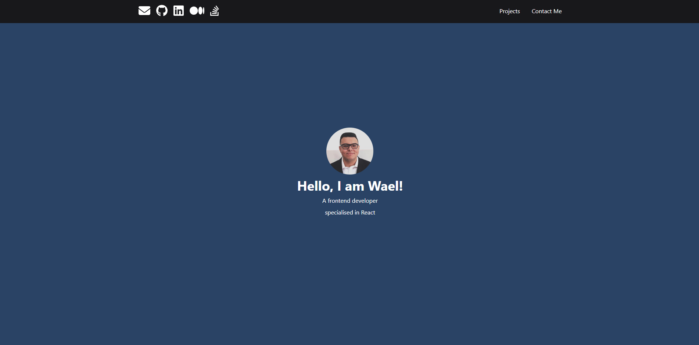
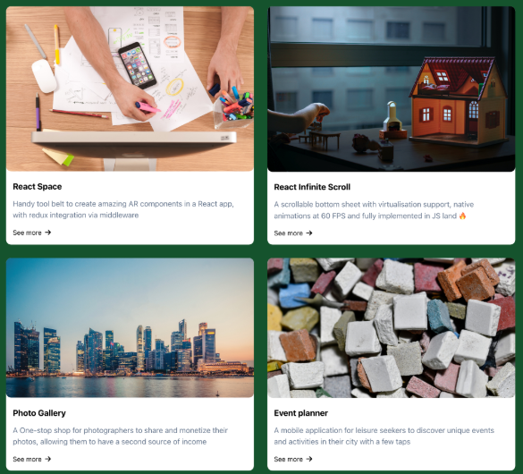
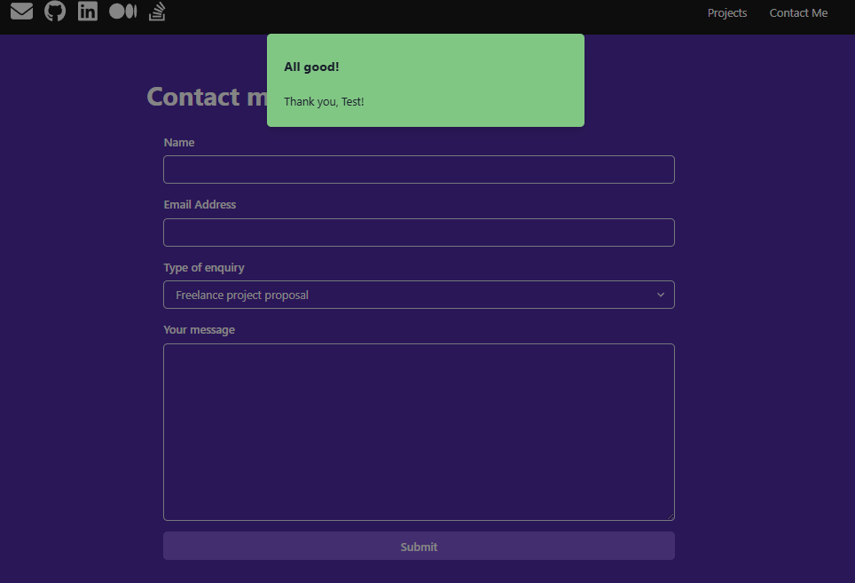

# 📘 Advanced React Project (Meta Front-End Developer Certificate)

This project was created as part of the Advanced React course from the Meta Front-End Developer Professional Certificate.

It demonstrates the use of advanced React patterns including:

- Custom Hooks
- Formik for form management and validation
- Chakra UI for component styling
- Context API for global state (Alert System)
- Async form submission simulation
- Schema validation with Yup

## 🚀 Features
- **Custom Form Submission Hook** (`useSubmit`)
- **Global Alert Context** (`useAlertContext`)
- **Formik-powered Form**
- **Client-side Validation** (with Yup)
- **Styled with Chakra UI**
- **Simulated API Call** (using a random success/failure logic)

## 🛠 Tech Stack
- React (with Hooks)
- Formik
- Chakra UI
- Yup
- Context API

## 🧠 Key Concepts Practiced
- **Managing asynchronous state correctly in React.

- **Building custom hooks for side effects (API simulation).

- **Handling global modals/alerts through Context API.

- **Implementing form validation using Yup.

- **Deep understanding of React event flows and browser behavior (select inputs, async updates).

## 📸 Screenshots

